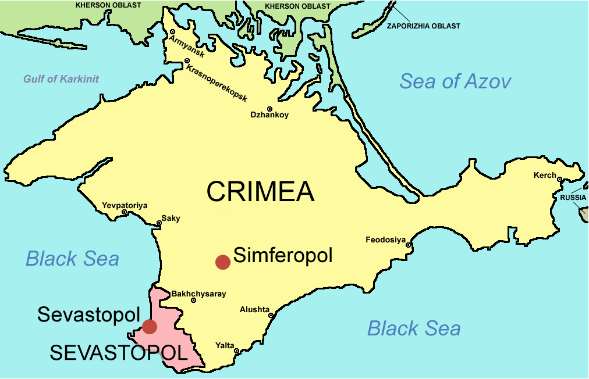

My research as to the connection between nationalism and the annexation of Crimea can be summed up as follows:

## Russian identification

A conflict in national identity may have been a precursor to annexation. The Crimean ethnocentrism which was documented in Stepaneko’s survey shows up in the Orange Revolution (Korostelina 2008).  This comparison reveals another explanation for the Crimean non-involvement with the Revolution; they felt themselves superior to the rest of Ukraine, and did not feel that the political activity pertained to them. As of 2003, the relations the Crimea had with Russia was still closer than its relations with Ukraine, as internal tensions between language use and the opinion of Russia grew to violent proportions (Rodgers 2006). 

## Discrimination

Due to their friendly relationship with Russia and their language, Russians in Ukraine were looked down upon as enemy fraternizers by western Ukraine. As compared with findings from Janmaat, Crimean people fought the language law for several years (1999). As time progressed, and more of Ukraine started speaking Ukrainian instead Russian, discrimination against Crimea was a norm. Western regions saw Crimea as an area that was refusing to cooperate with Ukrainian nationalism in favor or Russia. Crimea saw the Ukraine as implementing language as a way to culturally override their ethnicity. This created a lot of tension between the areas, and violent demonstrations would occur. 

## Resistance to assimilation

On a functional perspective, Crimea was a dysfunctional region in Ukraine. The Crimeans met the assimilation attempts with resistance and violence against Ukraine. Their language, culture, heritage, religion, political party views, and collective mentality was the same as Russia. Introducing hardships and attempting to assimilate a nationality made the people in Crimea more resolved and aggressive in preserving their Russian nationalism. As the conflicts between Ukrainians and Crimeans escalated, Crimea voted to separate their region from Ukraine. Once separated from Ukraine, Russia annexed Crimea. This annexation meant that those in Crimea can retain their nationality without facing discrimination in their nation.

To read complete project: <a href="https://github.com/kodayv/Analysis/blob/master/CrimeaAnalysis.pdf"><i class="large github icon "></i>CrimeaAnalysis.pdf</a>
