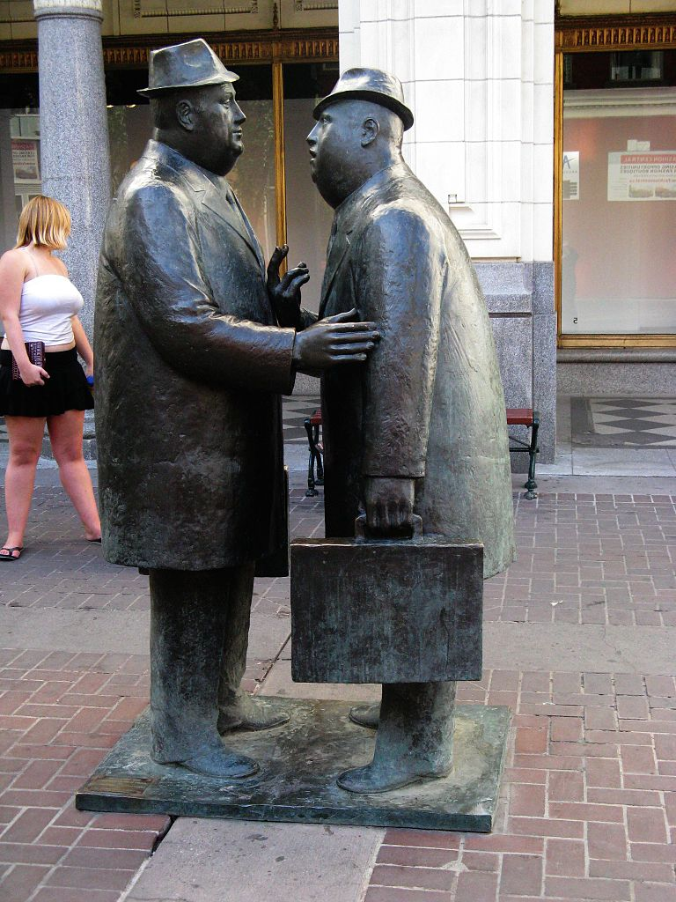
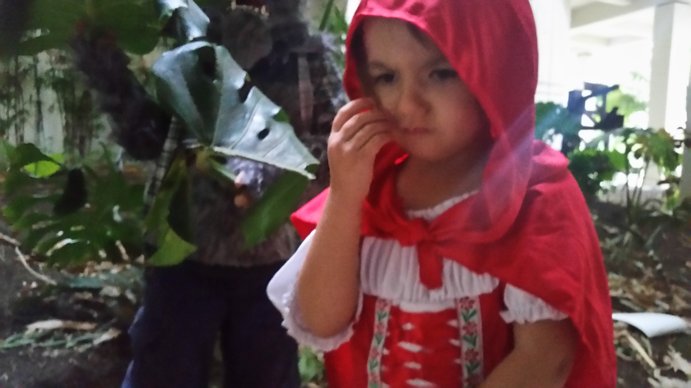

While living in California, I my apartment was next door to a Russian couple and their daughter. They were of the polite and quiet sort, so we were friendly but not socially connected to them. One of my school projects involved me conducting interviews with other people, and I took this opportunity to get to know my neighbors. The lady I interviewed was in America as a scientist and she taught me a lot about her culture, with its similiarites and differences. 

One note of interest was that she constantly referred to the people she associated with as ‘colleagues’. When asked about this use of word, she told me that colleague is the word for coworker, and is also a word for friend. It is a social expectation that those who you work with will also be those who you are friends with. Being of the notion that you leave work at work, I was interested on how the sense of community was instilled to a Russian around their place of work.

Among Russians, casually touching the person that is being conversed with is a norm. To not do it is a sign of rejection. She attended a few social groups in America and discussed how people attended preferred to keep their distance and not touch one another. She felt that her culture was more emotionally supportive of one another, where those in her American groups will want only superficial news about a person’s well-being. 

 She made mention that in America, the facial expressions of almost everybody is happy, as people here smile a lot more. In Russia those whom a person is conducting business with, including the cashier at a store, will not smile. Smiles are special expressions reserved for friends. During the years she has spent working in America, she has adapted, and smiles to strangers although she still sees it to be odd and less sincere.

