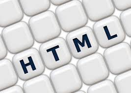

## The world of HTML and CSS

When I first started learning how to develop a website, I went to the basics. The [resulting page](http://kodayv.ics415.com/campus/introduction.php) was basic and honestly boring, as you can see. Being functional only as a page with information, it fails at maintaining the interest of the viewer. In today’s world of technology, part of the function of a webpage is that it is pleasing to the eye to behold, and strikes interest in the viewer. HTML and CSS by itself is difficult to achieve that level of attraction.

## CSS Frameworks

The next level of my web development journey took me to use a CSS framework, called [W3](https://www.w3schools.com/w3css/default.asp). This framework allowed me to make aesthetically pleasing pages [like this one](http://www2.hawaii.edu/~kodayv/ics311f16/). With an already established CSS, making nice webpages was easier and faster, after the initial commitment to learn the directory. This framework was also free for public use, so there is no monetary commitment. 

## UI Frameworks

The last level of web development took me to a UI Framework. [Semantic UI](http://semantic-ui.com/) was the framework I used in this experience. I was fortunate to have the ability to use the framework under the University’s Student subscription, allowing me to bypass the cost of the program.  This framework was also complicated to get started with. A lot of time was devoted to understanding how the framework could be applied to a website. However, once the educational commitment was completed, the framework enabled me to develop a professional webpage [like this one](http://www2.hawaii.edu/~kodayv/ics311f16/snow.html) in a fairly reasonable amount of time. 

## Which is Better?

My journey in this realm of web development has given me an appreciation of all the various tools available to use. The question what is better actually will depends on the preference of time versus cost. Using a UI platform, while lowering the time of development once learned how to use, also costs money. The CSS framework, also requiring learning time, requires a little more time in development but can still produce similar results with no added costs. Both will make a webpage attractive and functional in less time that raw HTML and CSS. Personally, I do not believe that something is worth more because it costs more, and will lean towards developing web pages at competitive prices due to no subscription fees.
