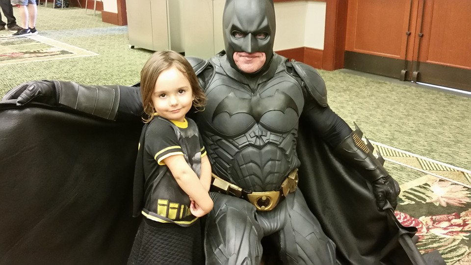

Software Engineering encompasses the design of a program, it development and testing, as well as the evaluation and maintenance of the completed program. A multitude of skills is required in order to be able to completely engineer a software program. Below are a skills that are of personal interest to me.

## Software Engineering Concepts
Becoming skilled at creating a program takes lots of practice. Proficiency in the design, implementation, and testing of a code require exrensive knowledge in the abilities of the programmer in the programming environment. Project management; including task managment, quality assurance, and beta testing are also important concepts in which working as a group is the only way to obtain experience. With these skills, I was able to work in a team to engineer a working program, whose project can be read about [here](http:)

## Athletic Software Engineering
Being able to plan and implement swiftly and accurately under pressure is a very important skill in life, regardless of field of study. Having participated in timed drills on coding to quickly and accurately program under pressure with timed exercises has sharpened my wit and coding ability.

## Professional Development
Developing this GitHub portfolio enabled me the opportunity to place my professional image more into the eye of the public. This is an extremely important part of anyone who is going into the workforce as the resume, accomplishments, projects, and essays allow a better connection to a prospecting corporation beyond what LinkedIn can give. 

