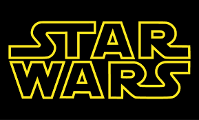

  

The BB-8 Game was developed to show mastery over the Java language. The game has the player control the Star Wars robot bb-8 as it dodges shooting lazers in its mission to reach Rey.

For this project, I lead the team in the planning of this project. I took charge of the algorithm for the shooting of the lazers. The lazers were made by the use of recursion, while tracking their locations. I also created the health display of BB-8, so that when the little robot made contact with a lazer, its health will decrease. I also created the animation of the introduction page and end. For the graphics; timing and loops were used to create the visual display.

I also compiled everyone's work into one functional program. To do this I had to read the different coding styles of three other team members, understand their codes,  and make it work with the rest of the program for both the Windows and MacOS.

It was enjoyable to work in a team, to create something together that required communication, collaboration, and teamwork. The resulting project became something in which we were all very proud of.

Here you can watch a recorded [video of the game](https://www.youtube.com/watch?v=8-63qS-Nhg4&feature=youtu.be).

