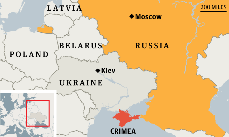

  

In March of 2014 the southern part of Ukraine called Crimea voted to seperate themselves from the rest of the Ukraine. Shortly aftwards Russia annexed Crimea. Out of personal curiousity of this recent event, I decided to commit my capstone thesis into finding out how the citizens of Crimea felt towards Ukraine and Russia.

Following the analytic process, I determined the problem to be one of nationality, of who the Crimeans identified themselves with.
I hypothesized that given the history of Crimea being a long standing part of Russia, and the continuing Russian military presence that there would be a lot of those who identified themselves to be Russian over Ukrainian.
Determining a great variey of information needs, I looked up history, reasarch, public opinion polls, and other various sources of informaion.
Evaluation of all the sources was required, as some articles that were found seemed to be attempting to force a bias.
With the credible data, I tested my hypothesis with the competing hypothesis that there would be a lot of people who identified themselves as not Russian.
Only passing scrutinization, my conclusion to the research was made and submitted to my client. 

To read complete project: <a href="https://github.com/kodayv/Analysis/blob/master/CrimeaAnalysis.pdf"><i class="large github icon "></i>CrimeaAnalysis.pdf</a>
